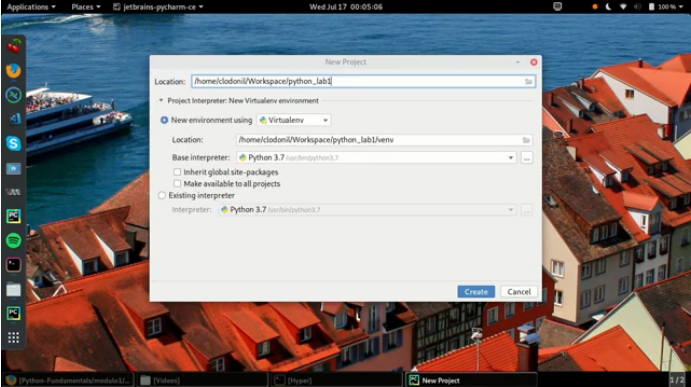

Laboratório do Módulo 1 
======

# Como trabalhar
Vamos colocar em prática o que aprendemos sobre a linguagem Python. 

Esse laboratório propoe um problema e suas soluções. Você deve trabalhar como `code review`, isso é entender o código e fazer modificações verificando o que muda. 

> Ao final do laboratório proponha perguntas para você mesmo e tente responde-lás desenvolvendo o código em Python.


# Problema

No site da Wikipedia (https://pt.wikipedia.org/wiki/C%C3%A2mara_Municipal_de_S%C3%A3o_Paulo) temos uma listagem dos vereadores eleitos no municipio de São Paulo no ano de 2017.


Para obter os valores da lista dinamicamente, utilizaremos a biblioteca [`Scrapy_table`](code/lib/scrapy_table.py). Mais a frente vamos entender como foi desenvolvida essa biblioteca, mais agora o importante é saber utiliza-lá.

A biblioteca retorna as tabelas de uma página html. Se uma página tiver mais de uma tabela, informe qual delas deseja obter. Por exemplo, no código abaixo queremos pegar a tabela de número 5  `tables = site_connect.get_tables(5)`, que é a lista de vereadores. Veja no link (https://pt.wikipedia.org/wiki/C%C3%A2mara_Municipal_de_S%C3%A3o_Paulo) que existe várias tabela na página.

```python
# importa a lib para obter as tabelas da Wikipedia
from  lib.scrapy_table import Scrapy_Table
# Variavel com o link da tabela
url="https://pt.wikipedia.org/wiki/C%C3%A2mara_Municipal_de_S%C3%A3o_Paulo"
# Inicia a class para obter a tabela
site_connect = Scrapy_Table(url)
# Pegando a tabela 5 (Vereadores em exercicio)
tables = site_connect.get_tables(5)
```

Com essa informação, vamos responder as perguntas abaixo.desenvolvendo os códigos em Python.

Vamos utilizar os seguintes recursos da linguagem:
* Variável (String/Float);
* List
* Set
* Tuple
* for
* if
* Operadores
* Dicionário

> No manifesto [`requirements`](code/requirements) estão as dependências da [lib/scrapy_table.py](code/lib/scrapy_table.py). 

Vídeo com o exemplo da execução do exercicío 1.

[](https://youtu.be/vN9QlAm4qgU)

------

1. **Listar os 8 caracteres do nome do vereador para fazer o login de acesso aos sistemas:**

```
Exemplo de resposta:
       Eduardo
       Milton L
       Reginald
       Conte Lo
       Mario Co
       Eduardo
        ...
```
> Codificação: [m1_lab1.py](code/m1_lab1.py)

**Sugestão de alteração:**
- Crie o login com o formato nome.sobrenome;
- Crie o login com a primeira letra do sobrenoma + as letras do nome invertidas;
- Crie o login com 10 caractere, as letras devem ser obtidas do nome e sobrenome de forma aleatório; 

	 
2. **Listar os partidos que tiveram candidatos eleitos:**
   
```
Exemplo de Resposta:
    PDT
    PSDB
     ....
```
> Codificação: [m1_lab2.py](code/m1_lab2.py)

**Sugestão de alteração:**
- Listar os partidos ordenados pela quantidade de vereadores eleitos;
- Listas os partidos ordenados por ordem alfabética;
- Listas os partidos que não tiveram a cláusula de barreira; 


3. **Mostrar o somatória de todos os votos em vereadores:**
    
```Exemplo de Resposta: 2364.913'```
> Codificação: [m1_lab3.py](code/m1_lab3.py)

**Sugestão de alteração:**
- Mostrar o nome do vereador que teve mais votos;
- Mostrar os nomes dos vereadores que tiveram mais de 40.000 votos;
- Mostrar a méida de votos; 


4. **Pesquisar se tem algum vereador com os seguintes nomes (João, Eduardo, josé):**
```
Exemplo de Resposta:
   Eduardo Suplicy
   Eduardo Tuma
   João Jorge
   José Police Neto
```
> Codificação: [m1_lab4.py](code/m1_lab4.py)

**Sugestão de alteração:**
- Realize a pesquisa por mais de um nome;
- Pesquisar pelo nome e sobrenome do vereador;
- Utilize o comando `input` para realizar a entrada do nome do vereador;

	
5. **O partido que tive mais vereadores eleitos:**
   
```
Exemplo de Resposta: 
   PSDB com 10 vereadores
```
> Codificação: [m1_lab5.py](code/m1_lab5.py)

**Sugestão de alteração:**
- Partidos que tiveram o menor número de vereadores eleitos;
- Liste o nome do partido que teve mais vereadores eleitos e o nome dos vereadores abaixo;
- Utilize o comando `input` para entrar com o nome do partido, deve ser retornado os nome dos vereadores;


6. **Numero total de votos por partidos:**

```
Resposta: 
    PT teve 564.304 votos.
    DEM teve 239.54700000000003 votos.
    PV teve 116.849 votos.
    PP teve 80.052 votos.
    PSDB teve 422.56199999999995 votos.
    PTB teve 96.313 votos.
    PRB teve 161.194 votos.
    PMDB teve 80.79599999999999 votos.
    PR teve 145.926 votos.
    PSD teve 156.232 votos.
    PSB teve 98.977 votos.
    PPS teve 58.557 votos.
    PSC teve 30.382 votos.
    PROS teve 28.515 votos.
    PODE teve 21.849 votos.
    NOVO teve 19.425 votos.
    PSOL teve 28.476 votos.
    PHS teve 14.957 votos.
```
   
> Codificação: [m1_lab6.py](code/m1_lab6.py)

**Sugestão de alteração:**
- Formate os números para 2 casas decimais, use `float("{0:.2f}".format(votos))` 


7. **Pesquisar se tem algum vereador está na lista de investigados na Lava Jato:**
> Lista da Lava jato: https://pt.wikipedia.org/wiki/Lista_de_pessoas_envolvidas_na_Opera%C3%A7%C3%A3o_Lava_Jato
 
> Codificação: [m1_lab7.py](code/m1_lab7.py)

***
> By:
```python
Autor   = ['Clodonil Honorio Trigo','clodonil@nisled.org']
linkdin = 'https://www.linkedin.com/in/clodonil-trigo-4155722a'
Blog    = 'http://www.devops-sys.com.br'
```

